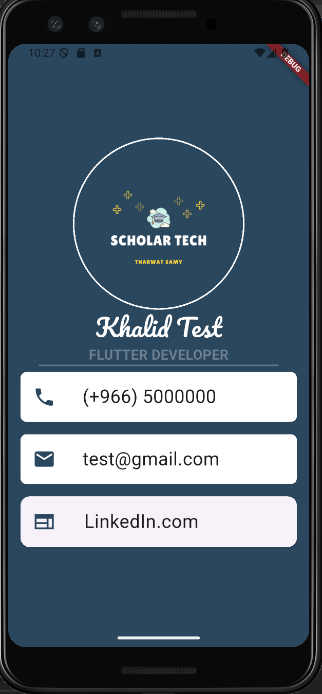

# 📇 Business Card App

A simple Flutter application that displays a digital business card with a profile picture, name, job title, phone number, email, and LinkedIn link.  
This project is great for learning Flutter layouts, styling, and widget composition.

---

## 🚀 Features
- Custom background color and styling.
- Profile picture with `CircleAvatar`.
- Name and title with custom fonts.
- Divider for clean separation.
- Contact information using `Container`, `Card`, and `ListTile`.
- Icons for phone, email, and LinkedIn.

---

## 🛠️ Built With
- [Flutter](https://flutter.dev)  
- [Dart](https://dart.dev)  

---

## 📷 Screenshot



---

## 📂 Project Structure
```
business_card_app/
│-- lib/
│ └── main.dart # Main entry point of the app
│-- images/
│ └── tharwat.png # Profile picture
│-- fonts/
│ └── Pacifico-Regular.ttf
│-- pubspec.yaml # Flutter dependencies
```

---

## ▶️ Getting Started
### 1. Clone the Repository
```bash
git clone https://github.com/your-username/business_card_app.git
```

### 2. Navigate to the Project
```bash
cd business_card_app
```
### 3. Install Dependencies
```bash
flutter pub get
```

### 4. Run the App
```bash
flutter run
```
